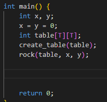

<!DOCTYPE html>
<html>
<body>
<h1> Problema celor 8 turnuri: să se scrie un program care plasează 8 turnuri pe tabla de șah, fără
ca acestea să se atace reciproc. </h1>

<h2> Main: </h2>

La inceput se vor declara variabilele x si y, scopul acesotra este de a schimba pozitia pe care vom pune primul turn pe tabla (ele vor creste la fiecare reapelare a functiei rock)

Pasul urmator va fi declararea matricei table de dimensiune T x T (T are valoarea 8), vom folosi aceasta matrice pe post de "tabla de sah" si aici vom "aseza turnurile"

Se apeleaza functia create_table care va pune 0 pe fiecare element al matricei data ca parametru, in cazul nostru table

Se apeleaza functia rock, o functie recursiva care va plasa turnurile, va afisa tabla de sah si va trece la urmatoarea posibilitate 

<h2> Functii folosite in rock: </h2>

Functie attacked este cea mai simpla functie din program, ea verifica daca parametrul primit este "atacat de un turn", verifica daca acel element din matrice se face pe aceeasi linie sau coloana cu numarul 5 care reprezinta turnul

<h2> Functiile attack_l si attack_c: </h2>

 Aceste functii sunt aproape identice, singura diferenta este ca una va pune toate elementele pe -1 de pe linie, iar cealalta de pe coloana

 Ideaa este ca turnul pus pe tabla va ataca linia si colana pe care se afla

<h2> Functia create_table: </h2>

 Aceasta functie a fost folosita si in main pentru a pune toate elementele pe 0, ea va fi folosita in functie rock pentru a "curata tabla de sah de turnuri"

<h2> Functia print_table: </h2>

 Functie de afisare a matricei, dar sub forma unei table de sah in care R reprezinta turnul (R de la rook din engleza) 

<h2> Functia rock: </h2>

 Aceasta este functie recursiva, primeste ca parametrii matricea table, variabilele x si y 

 Initial va pune pe tabla primul turn, pozitia lui va fi data de x si y

 Pasul urmator va fi sa parcurgem matricea in cautarea unei pozitii in care putem aseza urmatorul turn. Acest pas se va repeta pana nu mai este loc pe tabla

 Dupa ce "turnurile vor fi puse pe tabla" matricea este finalizata si se va apela functia de afisare 

 Variabilele x si y vor creste daca este cazul 

 Se apeleaza functia create_table 

 Se apeleaza functia rock cu noii parametrii x si y 

